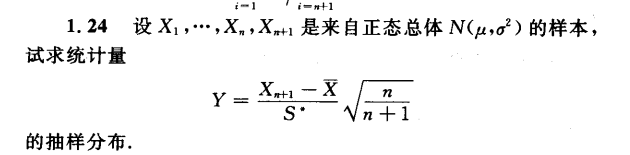
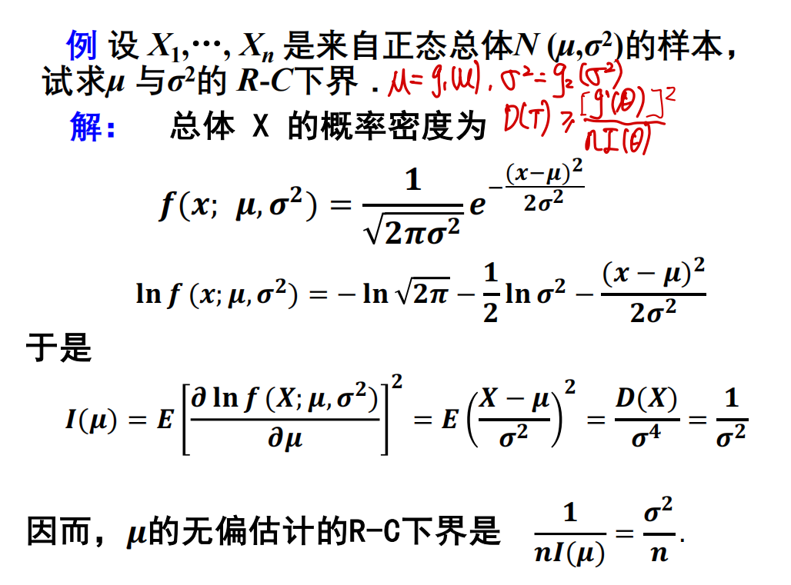
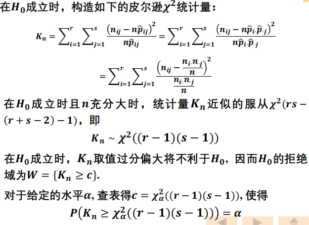
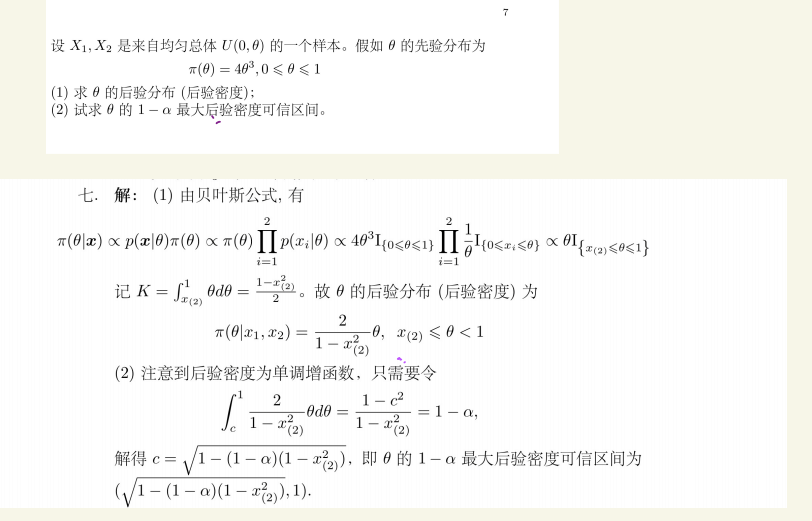

# 数理统计 26年期末考试回忆

数理统计考了8道大题，考得不深，但覆盖面比较广。

## 第一题

第一题考的是抽样分布，给定一个带未知系数的统计量，求解未知系数使其符合一个常见的概率分布。题目和作业题基本是一样的，只是题目需要求解根号下的那个系数。

## 第二题

第二题考察的是参数估计的评判标准。第一问是计算两个参数的点估计是否是无偏的，**这里第二个参数估计的计算涉及到了半正态分布的均值和方差**，需要额外补充知识点。第二问是考察点估计的有效性，需要计算RC下界，题目和PPT上例题基本是一致的：

## 第三题

第三题考察的是非参数假设检验，这里需要计算两个总体是否独立：

## 第四题 - 第七题

第四题到第七题考察都很常规，和作业题基本一致。考察的内容包括单因素方差绘制表格，假设检验构造统计量，以及一元线性回归的参数计算以及线性假设估计等，具体题目有点忘了。

## 第八题

最后一题考察的是贝叶斯，题目和PPT上的例题是一样的：

