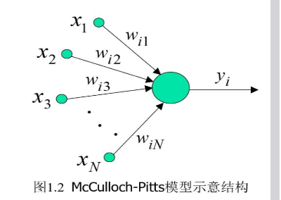
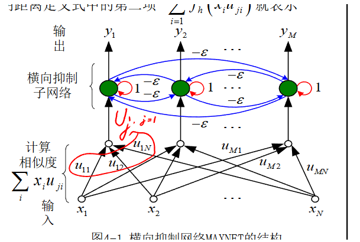

# 神经网络导论及应用 期末题目回忆

26年的神经网络导论期末题型包括8道选择，6-8道判断，4道简答题以及3道综合题，其中综合题分值是18、18、16（大概）。

## 选择 & 判断

选择判断题都是纯概念题，这里把PPT的各个知识点了解了就不会有什么大问题，都比较简单和基础。略超出预期的，是选择题中考察了联想记忆网络，比如BAM，在给定M对维度分别为N和P的矢量对时，网络需要的神经元个数。

## 简答题

简答题也都比较常见，但考试了几个复习时没想到的点。

第一个简答题考察了绘制网络:

最后一个简答题考了用hopfield网络做联想记忆时，需要的神经元个数

## 综合题

综合题分数占比最大，第二三四章各一道。

### 第二章

第二章考了三个问题：

1. 分析为什么基于硬限幅函数的三层前向神经网络能够解决凸集合的分类问题
2. 分析基于线性函数的三层前向神经网络能不能解决凸集合的分类问题
3. 算BP，这里给了PPT里的公式，然后要带入到具体的网络里求权重更新量的表达式

### 第三章

第三章考了TSP问题。第一个问是解释什么是TSP问题，第二个问是解释TSP的能量函数各个项的含义，最后一个问题是算TSP能量函数的 w_ij。这里要么背公式，要么根据他给的TSP能量函数和第二问的表达式比较系数。

### 第四章

第四章第一问考绘制 maxnet 的网络结构，这个很出乎意料，没想到会这么考。

第二问让简要介绍ART1，不需要公式。

第三问有点忘，但应该不大难。